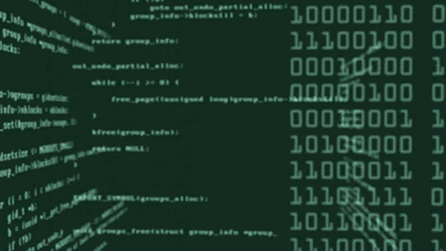
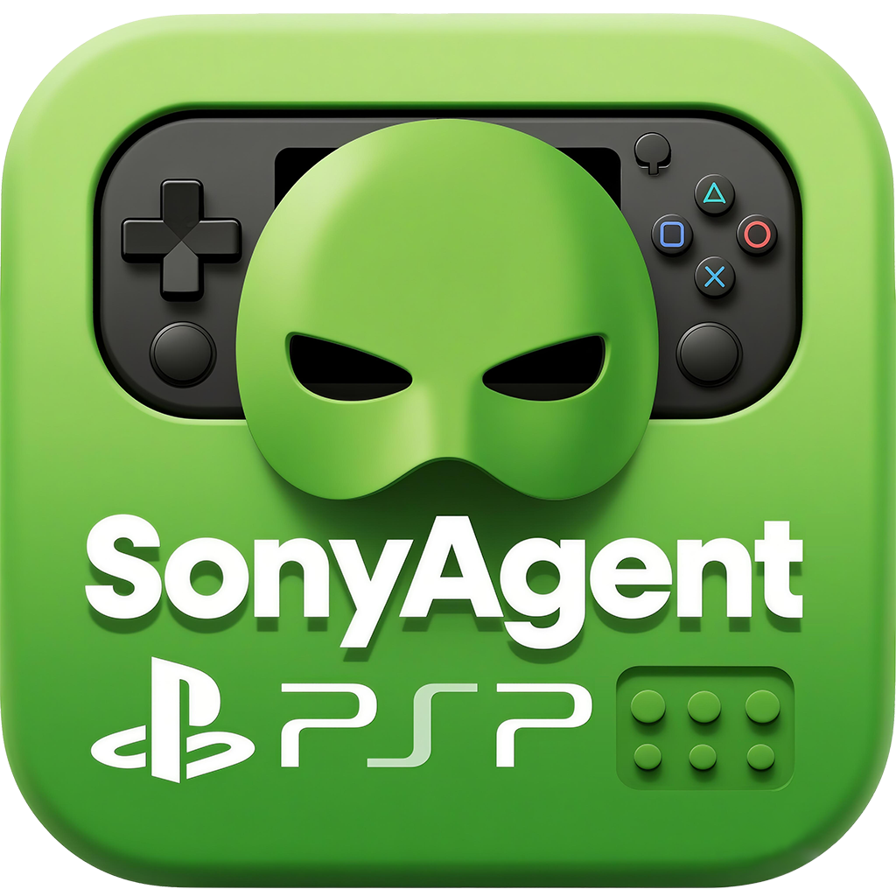

<h1 align="center">
  
</h1>

<!--    -->
  
  
  

<h1 align="center">
  
</h1>
<H1 align="center""> &nbsp; s &nbsp; o &nbsp; n &nbsp; y &nbsp; a &nbsp; g &nbsp; e &nbsp; n &nbsp; t &nbsp; . &nbsp; c &nbsp; o &nbsp; m &nbsp; </H1>
<H1 align="center">8 &nbsp; 0 &nbsp; 8 &nbsp; 7</H1>
<H1 align="center""> &nbsp; k &nbsp; r &nbsp; . &nbsp; s &nbsp; o &nbsp; n &nbsp; y &nbsp; a &nbsp; g &nbsp; e &nbsp; n &nbsp; t &nbsp; . &nbsp; c &nbsp; o &nbsp; m &nbsp; </H1>
<H1 align="center">8 &nbsp; 0 &nbsp; 8 &nbsp; 3</H1>
<H1 align="center">ENJOY!</H1>
<H1 align="center">ONE MORE SONYAGENT COMING SOON!</H1>
<H3 align="center" style="color: red;">經查，SonyAgent香港主埠俾不明單位狂打落地IP，現已將 /24 路由轉交 GSL 恒常洗流量，🇭🇰主埠時有攻擊，🇰🇷泡菜埠新上线！华东南直连飙速㊙️</H3> 

## ☕「大力捐助SONYAGENT」即可獲得 🎁專屬域名(speed++) + 📜鸣谢單！

  <h3>伺服器維護成本好高，如果SonyAgent幫到你，請捐助我哋長遠維持項目運作！</h3>
  
If this project helps you, please consider supporting us!

  
<em>點擊下方選項，睇吓對應嘅贊助Alipay QR code</em>

  

    
<strong>🧋 請我喝奶茶 | Buy me a milk tea</strong>

     
    

      
      
<em>多謝你嘅支持！請備註你想公開嘅名，我哋會放喺鳴謝單！ 支持無限期累計，每滿96都會附送出一個專屬域名，備注好就行！</em>

    

  

  

    
<strong>🥤 請我喝Luckin | Buy me a Luckin</strong>

     
    

      
      
<em>多謝你嘅支持！請備註你想公開嘅名，我哋會放喺鳴謝單！ 支持無限期累計，每滿96都會附送出一個專屬域名，備注好就行！</em>

    

  

  

    
<strong>☕ 請我喝Starbucks | Buy me a Starbucks</strong>

     
    

      
      
<em>多謝你嘅支持！請備註你想公開嘅名，我哋會放喺鳴謝單！ 支持無限期累計，每滿96都會附送出一個專屬域名，備注好就行！</em>

    

  

  
  

    
<strong>💝 隨心支持 | Free donation</strong>

     
    

      
      
<em>多謝你嘅支持！請備註你想公開嘅名，我哋會放喺鳴謝單！ 支持無限期累計，每滿96都會附送出一個專屬域名，備注好就行！</em>

    

  

  
  

    
<strong>🚀 大力支持本项目 | Full support</strong>

     
    

      
      
<em>多謝你嘅大力支持！請留低你嘅郵箱email，我哋會赠送你專屬域名： 
   🎁好似：x.sonyagent.com / vip.sonyagent.com / lol.sonyagent.com 
   🎁域名前綴任你選擇（當然要冇人搶注先啦⚡捐助時請備注好你的郵箱） 
   🎁專屬域名端口將恆久固定（除非特殊情況會改） 
   🚀融合内地技術達人方案⚡提升專屬Server速度「已融合完成」

      

    

  

  

    🔥你嘅支持無分大小，齊心㩒实 SonyAgent 行得更長遠！🔥 
    🔥Your support is the driving force for our continuous development!🔥
  

  

## 📜 鸣谢单 「神力貢獻榜」
| 💖 豪 ✨✨✨✨✨  | 💖  睦夜楓子元 ✨✨✨✨✨ | 💖 jiuxiang ✨✨ | 💖 夠硬 ✨✨✨✨✨✨ | 💖 翔 ✨✨✨✨✨  | 💖 佚名-m ✨✨|
|:--------:|:--------:|:--------:|:--------:|:--------:|:--------:|
| 💖 **柯** ✨✨✨✨✨ | 💖  **佚名-t** ✨✨ | 💖**良** ✨✨✨✨✨ | 💖**Cappuccino** ✨✨✨✨✨ | 💖**vita** ✨✨✨✨✨ | 💖**润** ✨✨✨✨✨ |
| 💖**宁** ✨✨✨✨✨ | 💖**友** ✨✨✨✨✨ | 💖**政** ✨✨✨✨✨ | 💖**AlexXchaN** ✨✨✨✨✨ | 💖 **溜溜** ✨✨✨✨ | 💖**火焰肉丸** ✨✨✨✨✨ |
| 💖**年** ✨✨✨✨✨ | 💖**Hoyin** ✨✨✨✨✨ | 💖**辉** ✨✨✨✨✨ | 💖**keyaki欅** ✨✨✨✨✨ | 💖**佚名-k** ✨✨ | 💖**豆子先生** ✨✨✨✨✨ |
| 💖**Jio芒果** ✨✨✨✨✨ | 💖**昕** ✨✨✨✨✨ | 💖**超** ✨✨✨✨✨ | 💖**洋** ✨✨✨✨✨  | 💖**AlfaRivieor** ✨✨✨✨✨ | 💖**MarkZ** ✨✨✨✨✨ |
| 💖**俊** ✨✨✨✨✨ | 💖**直** ✨✨✨✨✨ | 💖**yang** ✨✨✨✨✨ | 💖**浩** ✨✨✨✨✨ | 💖**顺** ✨✨✨✨✨ | 💖**凉意** ✨✨✨✨✨ |
| 💖**Liang丶** ✨✨✨✨✨ | 💖**Dr.** ✨✨✨✨✨ | 💖**一十.** ✨✨✨✨✨ | 💖**想** ✨✨✨✨✨ | 💖**小熊维尼鸣** ✨✨✨✨✨ | 💖**明** ✨✨✨✨✨ |
| 💖**毅** ✨✨✨✨✨ | 💖**kirito** ✨✨✨✨✨ | 💖**静** ✨✨✨✨✨ | 💖**炼** ✨✨✨✨✨ | 💖**特派员** ✨✨✨✨✨ | 💖**84** ✨✨✨✨✨ |
| 💖**吕蒙** ✨✨✨✨✨ | 💖**驴** ✨✨✨✨✨ | 💖**宇** ✨✨✨✨✨ | 💖**芃** ✨✨✨✨✨ | 💖**鱼** ✨✨✨✨✨ | 💖**佚名-m** ✨✨ |
| 💖**玩主機的大師兄** ✨✨✨✨✨ | 💖**轩** ✨✨✨✨✨ | 💖**树** ✨✨✨✨✨ | 💖**佚名-j** ✨✨ | 💖**祈** ✨✨✨✨✨ | 💖**涛** ✨✨✨✨✨ |
| 💖**理** ✨✨✨✨✨ | 💖**杰** ✨✨✨✨✨ | 💖**鹏** ✨✨✨✨✨ | 💖**铖** ✨✨✨✨✨ | 💖**宇** ✨✨✨✨✨ | 💖**简言** ✨✨✨✨✨ |
| 💖**勤** ✨✨✨✨✨ | 💖**鸣** ✨✨✨✨✨ | 💖**雫** ✨✨✨✨✨ | 💖**驰** ✨✨✨✨✨ | 💖**xxx193217** ✨✨✨✨✨ | 💖**昊** ✨✨✨✨✨ |
| 💖**旭** ✨✨✨✨✨ | 💖**昊** ✨✨✨✨✨ | 💖**佚名-x** ✨✨ | 💖**神父老爷** ✨✨✨✨✨ | 💖**平** ✨✨✨✨✨ | 💖**恒** ✨✨✨✨✨ |
| 💖**kirito** ✨✨✨✨✨ | 💖**儒** ✨✨✨✨✨ | 💖**晶** ✨✨✨✨✨ | 💖**坚** ✨✨✨✨✨ | 💖**全** ✨✨✨✨✨ | 💖**文** ✨✨✨✨✨ |
| 💖**鸣** ✨✨✨✨✨ | 💖**淋** ✨✨✨✨✨✨ | 💖**Makoto** ✨✨✨✨✨ | 💖**帆** ✨✨✨✨✨ | 💖**波** ✨✨✨✨✨ | 💖**阳** ✨✨✨✨✨ |
| 💖**杰** ✨✨✨✨✨ | 💖**皮卡不是丘** ✨✨✨✨✨ | 💖**毅** ✨✨✨✨✨ | 💖**栋** ✨✨✨✨✨✨ | 💖**月** ✨✨✨✨✨ | 💖**礼奈的柴刀** ✨✨✨✨✨ |

👉 齊心撐場，排名不分先後 👈

Maintained by **<a href="https://agi.tech" target="_blank">AGI, Inc.</a>**
## 📚 Docs

**You can find more info in the [docs](https://agentprotocol.ai/).**

## 🧾 Summary

The AI agent space is young. Most developers are building agents in their own way. This creates a challenge:
It's hard to communicate with different agents since the interface is often different every time.
Because we struggle with communicating with different agents, it's also hard to compare them easily.
Additionally, if we had a single communication interface with agents, it'd also make it easier developing devtools that works with agents out of the box.

We present the **Agent Protocol** - a single common interface for communicating with agents.
Any agent developer can implement this protocol.
The Agent Protocol is an API specification - list of endpoints, which the agent
should expose with predefined response models.
The protocol is **tech stack agnostic**. Any agent can adopt this protocol no
matter what framework they're using (or not using).

We believe, this will help the ecosystem grow faster and simplify the integrations.

We're starting with a minimal core. We want to build upon that iteratively
by learning from agent developers about what they actually need.

## 🚀 The incentives to adopt the protocol

- Ease with which you can use the benchmarks.
- Other people can more easily use and integrate your agent
- Enable building general devtools (for development, deployment and monitoring)
  that can be built on top of this protocol
- You don’t need to write boilerplate API and you can focus on developing your
  agent

## 🎯 Immediate goals of the protocol

Set a general simple standard that would allow for easy to use benchmarking of
agents. One of the primary goals of the protocol is great developer experience,
and simple implementation on the end of agent developers. You just start your
agent and that’s all you have to do.

## 🗣️ Request for Comments

If you'd like to propose a change or an improvement to the protocol. Please
follow the [RFC template](./rfcs/template.md).

## ⚙️ Components

### [Protocol](./schemas/openapi.yml)

The most important part. It specifies which endpoints should the agent expose.
The protocol is defined in [OpenAPI specification](./schemas/openapi.yml).

#### How does the protocol work?

Right now the protocol is defined as a REST API (via the
[OpenAPI spec](./schemas/openapi.yml)) with two essential routes for interaction with
your agent:

- `POST /ap/v1/agent/tasks` for creating a new task for the agent (for example giving
  the agent an objective that you want to accomplish)
- `POST /ap/v1/agent/tasks/{task_id}/steps` for executing one step of the defined task

It has also a few additional routes for listing the tasks, steps and downloading / uploading artifacts.

### [SDK](https://github.com/AI-Engineer-Foundation/agent-protocol/tree/main/packages/sdk)

This is our implementation of the protocol. It’s a library that you can use to build your agent. You can use it, or you can implement it on your own. It’s up to you.

Using the SDK should simplify the implementation of the protocol to the bare minimum, but at
the same time it shouldn't tie your hands. The goal should be to allow agent
builders to build their agents and the SDK should solve the rest.

Basically it wraps your agent in a web server that allows for communication with
your agent (and in between agents in the future).

### [Client](https://github.com/AI-Engineer-Foundation/agent-protocol/tree/main/packages/client)

This library should be used by the users of the agents. Your agent is deployed somewhere and the users of your agent can use this library to interact with your agent.

Thanks to the standard the users can try multiple agents without the need for any additional adjustments (or very minimal) in their code.

## 📦 How to use the protocol

If you're an agent developer, you can use the SDK to implement the protocol. You can find more info in the [docs](https://agentprotocol.ai/) or in the [SDK folder](./sdk).

## 🤗 Adoption

### Engaged projects in development of agent protocol

- [e2b](https://e2b.dev)
- [Auto-GPT](https://news.agpt.co/)

### Open-source agents and projects that have adopted Agent Protocol

- ✅ [Auto-GPT](https://github.com/Significant-Gravitas/Auto-GPT)
  - Track [PR here](https://github.com/Significant-Gravitas/Auto-GPT/pull/5044)
- ✅ [Auto-GPT-Forge](https://github.com/Significant-Gravitas/Auto-GPT-Forge)
- 🚧 [babyagi](https://github.com/yoheinakajima/babyagi)
  - Track [PR here](https://github.com/yoheinakajima/babyagi/pull/356). Waiting
    for merge.
- ✅ [smol developer](https://github.com/smol-ai/developer)
  - Track [PR here](https://github.com/smol-ai/developer/pull/123).
- 🚧 [beebot](https://github.com/AutoPackAI/beebot)
  - Might require more features. See
    [issue here](https://github.com/AI-Engineer-Foundation/agent-protocol/issues/9).

## 📃 High-level future roadmap

- Agent-to-agent communication
- Connection to the outside world:
  - 3rd party services (= “Agent I/O”)
  - Authentication on behalf of users
- Protocol Plugins
- Is there anything missing? Please submit an RFC with a proposed feature!

## 💬 Public discourse & development

- PRs and issues are welcome!
- Join [AIEF Discord](https://discord.gg/TxDzUWab) and their dedicated `agent-protocol` channel
- Join [Auto-GPT Discord](https://discord.gg/autogpt) and their dedicated
  `agent-protocol` channel
- Join [e2b Discord](https://discord.gg/U7KEcGErtQ) and their dedicated
  `agent-protocol` channel

## Star History

